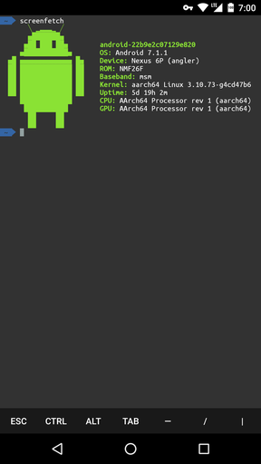

# Termux-ohmyzsh

A fork from [oh-my-termux](https://github.com/4679/oh-my-termux) 。让你的 Termux 变的五颜六色～

为 Termux 添加 [oh-my-zsh](https://github.com/robbyrussell/oh-my-zsh) 终端环境，设置色彩样式（大部分来自 [Gogh](https://github.com/Mayccoll/Gogh) ）和 Powerline 字体（来自 [powerline/fonts](https://github.com/powerline/fonts)）。oh-my-zsh 主题默认为 agnoster，颜色样式默认为 Tango，字体默认为 Ubuntu。

**此 Repo 使用 Termux 官方源，在中国大陆可能需要将 Termux 应用添加到代理列表。**
## 使用：
```shell
sh -c "$(curl -fsSL https://github.com/Cabbagec/termux-ohmyzsh/raw/master/install.sh)"
```

## 设置色彩样式：
运行更换色彩样式：
```shell
~/.termux/colors.sh
```

## 设置字体
运行更换字体：
```shell
~/.termux/fonts.sh
```

## 需要：
 - curl

Tango 颜色主题 + oh-my-zsh agnoster 主题 + Ubuntu 字体：


- - - 

# Termux-ohmyzsh

A fork from [oh-my-termux](https://github.com/4679/oh-my-termux). It makes the app more colorful.

Termux-ohmyzsh implements oh-my-zsh on your Termux app, as well as some color schemes (most are from [Gogh](https://github.com/Mayccoll/Gogh)), and some Powerline fonts (ported from [powerline/fonts](https://github.com/powerline/fonts)). Default set is agnoster for oh-my-zsh, Tango for color scheme, and Ubuntu font.


**This repo requires Termux official repo. In mainland China, you may need to add Termux app to your proxy list in order to gain access to Termux official repository.**

## Install:
```shell
sh -c "$(curl -fsSL https://github.com/Cabbagec/termux-ohmyzsh/raw/master/install.sh)"
```

## Change color scheme:
Run the script to change color scheme.
```shell
~/.termux/colors.sh
```
## Change font:
```shell
~/.termux/fonts.sh
```

## Requirements:
 - curl

Tango color scheme + agnoster oh-my-zsh theme + Ubuntu font:

